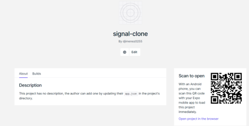
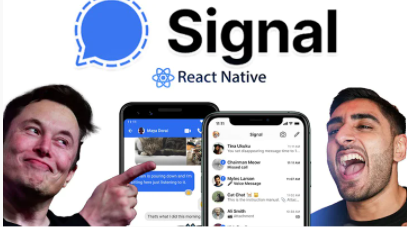

<h1>There is a special link below regarding the application</h1>

<h2>Click Link below to open up the application</h2>

<ul>
<li><a href="https://expo.io/@djimenez0255/projects/signal-clone">Click to See Project in Expo</a></li>
</ul>

    - The Link above will take you to the project landing page and you'll see a QR
    code on the right which can be seen below:

    -It is a special code to open up the project. Make sure to follow the rest of the
    steps below to open the application:

    - Make sure to have QR Scanning App(some have built in QR Scanner such as iPhones)
    so that the QR code can be scanned which will open it in the Expo Go App

    - Then download the Expo Go App on your phone so the scanned QR code will open up
    the project which is ran by Expo Go

## Go support Sonny! The link below is to the stream where he built this clone himself

<ul style="margin-top:20px">
<li><a href="https://www.youtube.com/watch?v=MJzmZ9qmdaE" >Click Me to see Stream Where Sonny Built the Signal Clone</a></li>
</ul>

<ul style="margin-bottom:20px">
<li><a href="https://www.youtube.com/user/ssangha32">Click Me to see Main Channel</a></li>
</ul>

    - Sonny is an amazing developer that has taught me everything I know about React and so much more.
    He is an amazing developer you'll learn so much from
